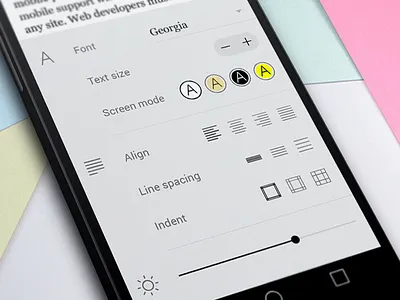

خیلی خیلی شلوغع! من این هم ه اطلاعات نمیخوام

خیلی جمع و جور و مینیمال میخوام

من این ها رو میخوام

در منوی سمت راست لیست سشن ها باشه
هر سشن نام  داره و یه i داره که روش  hover کنی اطلاعات بیشت popup میشه

ستون سمت چپ رو اصلا نمیخوام  کاوشگر نشست نمیخوام 

سشن رو اون وسط باید نشون بدیم 

یه هدر مینیمال داشته باشه که توش یه ذره بین برای جستجو هست
یدونه دکمه تنظمیات است که ایکن تنظیمات داره و بزنمی تنظیمات reader خیلی مینیمال باز میشه
 
هدر فقط همینه

غیر از هدر دیگه هر چیزی میشه صحفه چت

صفحه چت وقتی باز میشه به صروت پیشفرض روی اخرین پیام هست یعنی اسکریول تا ته پایین سهت

هیچ فلتر و ... ای هم نداره و هیچ
همه
پاسخ‌ها
پیام‌های شما
ابزارها
رخدادها

پیوسته به آخرین پیام برو

پیشنهاد حالت خواندن
پرش به آخر گفتگو
اینا رو اصلانمیخوام

پیام های خود کاربر خیلی باکس کوچیک تری باید داشته باشه

دکمه های کپی و حالت خواندن وو... هم نداشته باشه

پیام های دستیار باید اصل کار باشه
اما دکمه های کپی و خالت خوان چون طراحی سبکش مینیال است باید ایکن های کو چک باشه

مانند ایکن های که توی chatgpt و ... هست 

حالت خواندن نباید توی مدال باشه! گفتم باید تمام صفحه باشه! انگار کل صفحه رو گرفته
یه هدر داره که توش دکمه هست تنظیمات خوادن است  و جستجو که اگر زد تازه textbox  براش باز میشه یه دکنه ضربدر یعنی بسته شدن هم توی هدرش هست

و باقیش متن است و یه متو toc هم سمت راست داره

خود تظنیمات خواندن هم باید یه popover باشه که توش فونت باشه و سایز و فاضله خطوط و رنگ بندی

تنظمیات در این حد 

این که میگم مد خواندن و فول اسکرین نباید مدل باشه منظورم اینه که از نظر فنی میتونه مدال باشه اما از نظر ظاهری کرابر باید حس کنه اومده توی یه صفحه دیگه
عین یه صحفه کتاب خوان جز متن هیچ یزی دیگه ای نمیبینه 
یه هدر مینیمال میبینه

اسکوریل کل صفحه با اسکرول قسمت چت باید متفاوت باشه و کل صفحه اصلا نباید اسکرول بشه! مانند همه چت ها در وب
